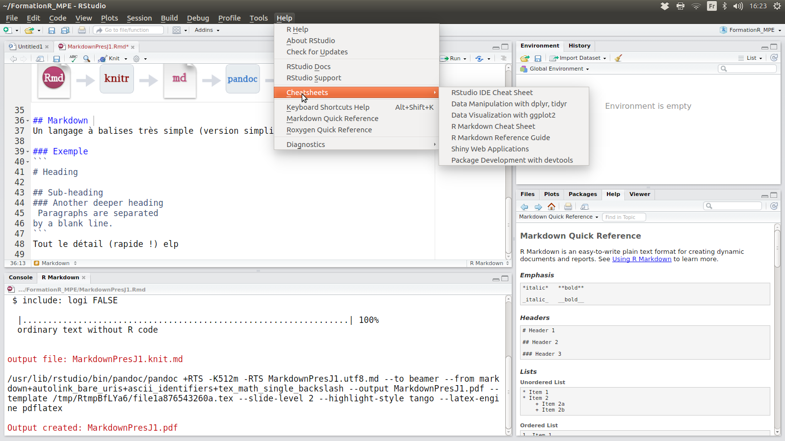
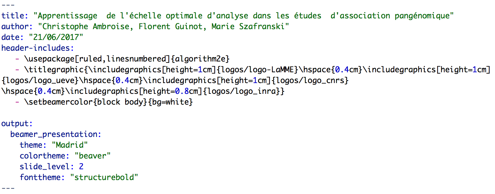
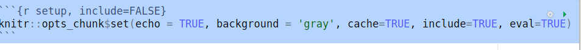

# RMarkdown {#rmarkdown}

```{r setup, include=FALSE}
knitr::opts_chunk$set(echo = TRUE, background = 'gray', cache=TRUE, include=TRUE, eval=TRUE)
```

##  RMarkdown pour quoi faire ? {#pourquoi}

### Automatisation de la production de document scientifique

Dans un contexte de science reproductible, produire

  - Présentation, article, notes de cours, livre, ...
  - Code
  - Données

sous la forme de documents PDF, HTML, MS Word etc ... 

Site web : <http://rmarkdown.rstudio.com>


## Comment ça marche

### Un exemple de fichier .Rmd : ce document {.smaller}


```{r,  out.width="50px", echo=FALSE, fig.show='asis'}
knitr::include_graphics("./images/ExempleMdFile.png", auto_pdf = TRUE, dpi = NA)
```


### Schéma conceptuel 


  
### Markdown 
Un langage à balises très simple (version simplifiée de html par exemple)

#### Exemple
```
## Heading

### Sub-heading
#### Another deeper heading
 Paragraphs are separated
by a blank line.
```
### Markdown Cheatsheet
Tout le détail (rapide !) 



### Pandoc
C'est un convertisseur de format de documents. Il sait 

- prendre un document d'un format x pour le passer en Markdown étendu
- prendre un document Markdown étendu pour le passer en un format y

De fait il peut passer d'un format x à un format y

<https://pandoc.org/MANUAL.pdf>

### RMarkdown [@R-rmarkdown]

C'est un document pandoc avec des balises spécifiques R. 
<http://rmarkdown.rstudio.com/lesson-1.html>


### De RMarkdown à un document finalisé avec knitr [@R-knitr]

Le bouton knit effectue les opérations suivantes :

  1. Extraire la partie Markdown texte
  2. Executer le code R pour produire les sorties demandées
  3. Intégrer les sorties précédentes dans un document html, word ou pdf


## Un document RMarkdown à la loupe

### Entete du document : YAML 



### Options globales pour le code R

Les options du code R du document peuvent être spécifiées par défaut 



### Code Chunk 
````python
`r ''````{r}
2+2
```
````

```{r, echo=FALSE, message=FALSE}
2+2
```

ou python, ou sql, bash ....

### R Code Chunk, quelques options utiles 


````python
`r ''````{r, fig.show='hide', warning=TRUE, message=FALSE}
data(cars)
m <- mean(cars$speed)
plot(speed~dist)
```
````

```{r, echo=FALSE, fig.show='hide', warning=TRUE, message=FALSE}
data(cars)
m <- mean(cars$speed)
with(cars, plot(speed~dist))
```


La vitesse moyenne est `r m`. 


